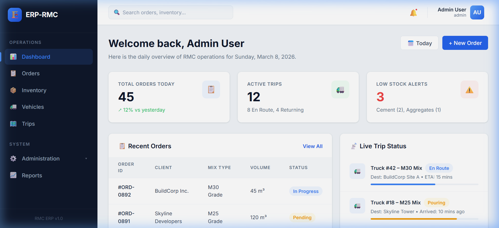
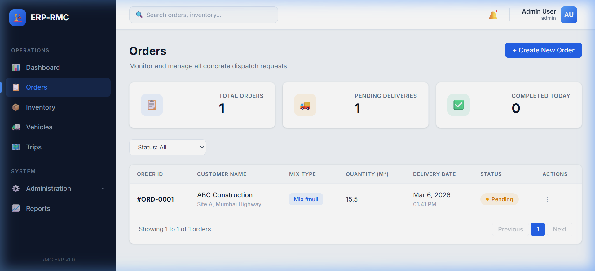
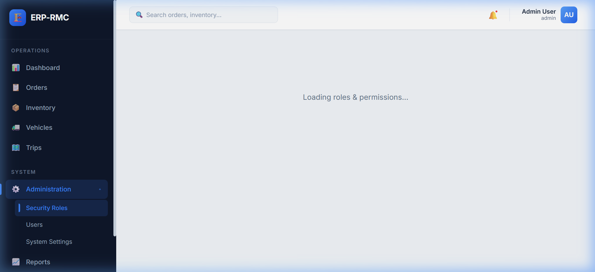

# RMC ERP System

A modern, responsive Enterprise Resource Planning (ERP) system tailored for Ready-Mix Concrete (RMC) operations. This application manages the entire lifecycle of concrete dispatch, from order creation and inventory tracking to live vehicle routing and role-based access control.

## 🚀 Features

### 1. Operations Dashboard
A centralized hub for daily operations, featuring:
- Live statistics for total orders, active trips, and low stock alerts.
- Live active order tracking and trip progress updates.



### 2. Order Management
Comprehensive order tracking and filtering:
- Advanced filtering by status, mix design, and delivery date range.
- Paginated table views.
- Real-time aggregated statistics (Pending, Completed).



### 3. Role-Based Access Control (RBAC)
Granular security and administration:
- Dynamic permission matrix for varying user roles (Admin, Dispatcher, Manager).
- Module-level View/Add/Update/Delete permissions.



### 4. Responsive Design
- Optimized for both desktop monitors and mobile/tablet field devices.
- Collapsible off-canvas sidebar for smaller screens.

## 🛠️ Tech Stack

**Frontend:**
- React 18 (Vite)
- React Router DOM
- CSS3 (Vanilla CSS with Custom Variables)
- Axios for API communication

**Backend:**
- Node.js & Express
- PostgreSQL
- JSON Web Tokens (JWT) for authentication

## 🏗️ Project Structure

The repository is organized into a full-stack monorepo:

```text
rmc-erp/
├── backend/       # Node.js/Express Server
│   ├── src/
│   │   ├── controllers/
│   │   ├── middleware/
│   │   ├── routes/
│   │   └── services/
│   └── package.json
└── frontend/      # React/Vite Application
    ├── src/
    │   ├── components/
    │   ├── context/
    │   └── pages/
    └── package.json
```

## ⚙️ Getting Started

### Prerequisites
- Node.js (v18+)
- PostgreSQL Database

### Installation

1. **Clone the repository:**
   ```bash
   git clone https://github.com/yourusername/rmc-erp.git
   cd rmc-erp
   ```

2. **Setup Backend:**
   ```bash
   cd backend
   npm install
   # Configure your .env file with DB coordinates
   npm run dev
   ```

3. **Setup Frontend:**
   ```bash
   cd ../frontend
   npm install
   npm run dev
   ```

4. **Access the Application:**
   Open your browser and navigate to `http://localhost:5173`.
